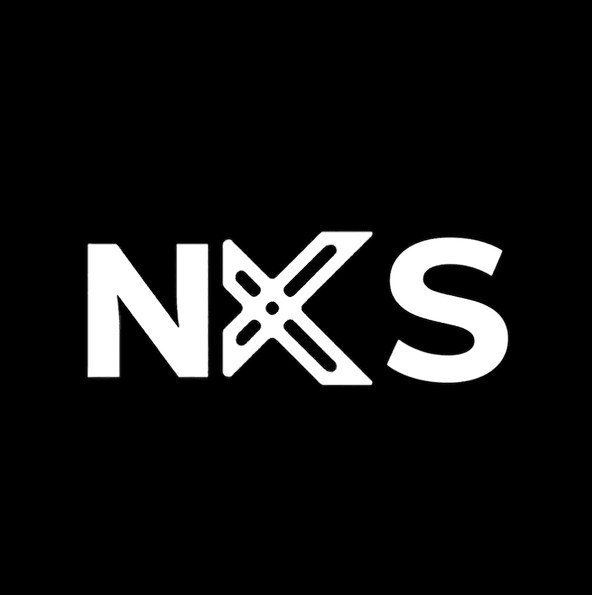

<div align="center">
  
  
  # NexSpace

  **The premier platform connecting elite developers with forward-thinking clients.**

  [](https://nextjs.org/)
  [](https://supabase.com/)
  [](https://tailwindcss.com/)
  [](https://www.typescriptlang.org/)
  [](https://opensource.org/licenses/MIT)

  [Live Demo](#) · [Report Bug](#) · [Request Feature](#)
</div>

---

## 📖 Overview

NexSpace is a high-performance, mobile-first marketplace architecture designed to bridge the gap between software developers and clients. It provides a dedicated ecosystem where **Developers** can construct stunning portfolios, gather social signals, and showcase technical expertise, while **Clients** can broadcast business problems, discover talent, and initiate real-time conversations.

Engineered with modern web standards, NexSpace prioritizes speed, security, and exceptional user experience across all devices.

## ✨ Enterprise-Grade Features

* **Passwordless Authentication Ecosystem**
  * Secure, frictionless 8-digit OTP email authentication powered by Supabase Auth.
  * Persistent sessions with automated token refresh cycles.
* **Role-Based Access Control (RBAC)**
  * Strict separation of concerns between `developer` and `client` entities.
  * Database-level Row Level Security (RLS) guaranteeing data isolation and integrity.
* **Real-time Communication Engine**
  * Instant messaging subsystem utilizing Supabase Realtime (WebSockets).
  * Live notification delivery for upvotes, tracks, and direct messages.
* **Algorithmic Feeds & Discovery**
  * Dynamic project showcases with taxonomy-based filtering (tech stack tags).
  * Problem board for clients to broadcast requirements and gather developer interest.
* **Social Graph & Reputation Metrics**
  * Bi-directional tracking (follow) system bridging networks.
  * Upvote mechanisms to algorithmically rank and curate top-tier projects.
* **Responsive, Adaptive Interface**
  * Liquid layouts tailored for mobile, tablet, and desktop environments.
  * Native-feeling mobile bottom navigation and global search overlays.

## 🏗️ Technical Architecture

NexSpace is built on a cutting-edge, serverless-first architecture:

- **Frontend:** Next.js 15 (App Router), React 19, TypeScript
- **Styling:** Tailwind CSS, Lucide React Icons
- **Backend-as-a-Service (BaaS):** Supabase (PostgreSQL, GoTrue Auth, Realtime, Storage)
- **Deployment:** Vercel (Edge Network)

### 📁 Project Structure

```text
nexspace_o1/
├── src/
│   ├── app/                # Next.js App Router (Pages, Layouts, API Routes)
│   ├── components/         # Reusable React UI Components (Server & Client)
│   ├── hooks/              # Custom React Hooks (e.g., useNotifications)
│   ├── lib/                # Core Utilities (Supabase client configs, Contexts)
│   └── types/              # Global TypeScript Definitions
├── public/                 # Static Assets (Images, Icons, Manifests)
├── schema.sql              # Base PostgreSQL Schema & RLS Policies
├── schema-addendum-*.sql   # Incremental Schema Migrations & Security Patches
├── tailwind.config.ts      # Tailwind CSS Design System Tokens
└── next.config.ts          # Next.js Compiler Configurations
```

## 🚀 Getting Started

Follow these instructions to set up a local development environment.

### Prerequisites

* Node.js (v18.17.0 or higher)
* npm, yarn, pnpm, or bun
* A [Supabase](https://supabase.com/) account and project.

### 1. Database Setup

1. Navigate to your Supabase project's SQL Editor.
2. Execute the contents of `schema.sql` to provision the base tables and Row Level Security (RLS) policies.
3. Execute the contents of **all** `schema-addendum-*.sql` files in chronological order (e.g., v1.1, v1.2, v1.3) to apply the latest features and security patches.
4. Navigate to Supabase Storage and create a new public bucket named `project-media`.

### 2. Local Environment Configuration

Clone the repository and install dependencies:

```bash
git clone https://github.com/YourOrg/nexspace.git
cd nexspace
npm install
```

Create a `.env.local` file in the root directory and populate it with your Supabase project keys:

```env
NEXT_PUBLIC_SUPABASE_URL=https://your-project-id.supabase.co
NEXT_PUBLIC_SUPABASE_ANON_KEY=your-anon-public-key
```

### 3. Start the Development Server

```bash
npm run dev
```

The application will now be running on [http://localhost:3000](http://localhost:3000).

## 🔒 Security Posture

Security is a first-class citizen in NexSpace. 
- **Row Level Security (RLS)** is strictly enforced across all PostgreSQL tables, ensuring users can only read, mutate, or delete data they explicitly own or have access to.
- Server Actions and API Routes validate authentication contexts server-side before executing privileged operations.
- Client-side environment variables are limited strictly to public, anonymous keys.

## 🤝 Contributing

We welcome contributions from the community. Please read our [Contributing Guidelines](CONTRIBUTING.md) for details on our code of conduct and the process for submitting pull requests.

## 📄 License

This project is licensed under the MIT License - see the [LICENSE.md](LICENSE.md) file for details.

---
<div align="center">
  <i>Built with precision for the modern web.</i>
</div>
